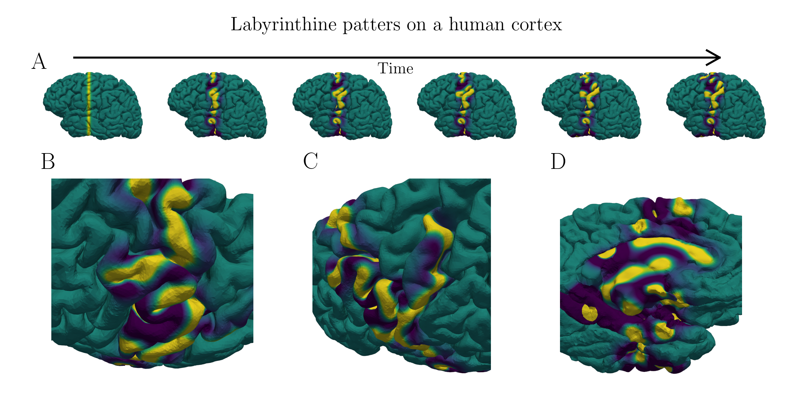

# neural-fields-rbf

This library is the implementation for the paper [*Radial Basis Function Techniques for Neural Field Models on Surfaces*](https://arxiv.org/abs/2504.13379).



# A demo using Jupyter

In the top level of this repository there is a Jupyter notebook titled *demo.ipynb*.
running this notebook requires installation of the repository as well as some plotting
packages.

This repository is installable via pip. To install it, open a terminal and run
```
pip install git+https://github.com/shawsa/neural-fields-rbf.git
```

Additionally the notebook requires the packages `matplotlib` and `pyvista` for plotting.
These can be installed using
```
pip install matplotlib pyvista
```

With the repository installed (or with the `neural-fields-rbf/src`
folder in your python path and all required dependencies available), you should be able
to run the notebook.
